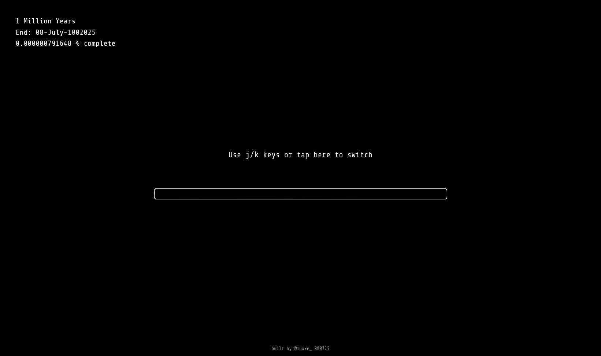

<h1 align="center">Long Loads</h1>

A website dedicated to the longest loading bars in the universe (and beyond).  
Playful, existential, and just a little bit mesmerizing.

Check out my loads!\
[longloads.com](https://longloads.com)

---
## What is this?

**Long Loads** is a collection of absurdly long loading bars, tracking time spans ranging from a single day to 1 million years (yes, really!).

Each bar updates live and represents different "loads":

Only three right now
- **Local Day** — Tracks your day, resets at midnight in your local time zone.
- **100-Year Load** — A bar that takes 100 years to "finish". It's still going!
- **1 Million Years Load** — A cosmic bar meant to remind you that time is... long.

---

## How does it work?

- Built with **Next.js**, **Tailwind CSS**, and **Cloudflare Workers**.
- Bars fetch progress data from server endpoints that calculate progress in real time.
- Client-side switches between bars with `j` / `k` keys or screen taps on mobile devices.
- Start date of all loads are date of website creation (at the bottom of the website).
